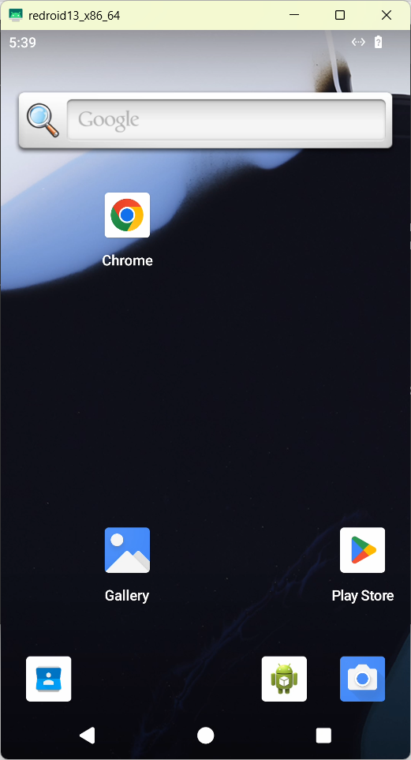
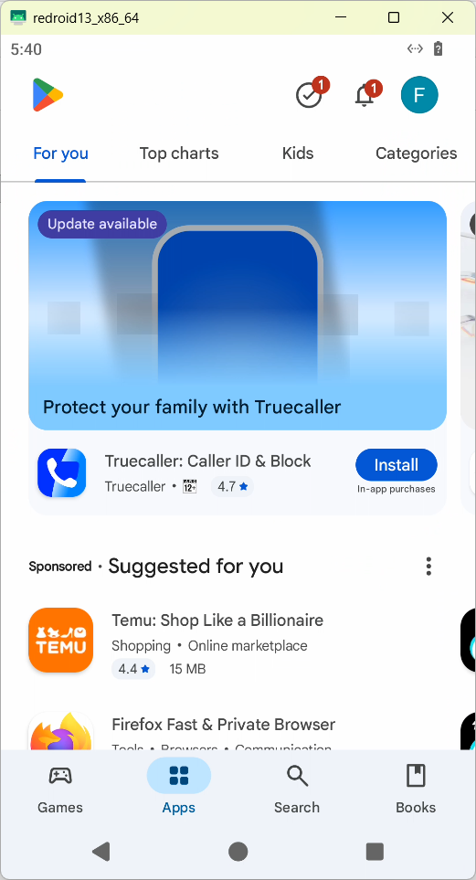
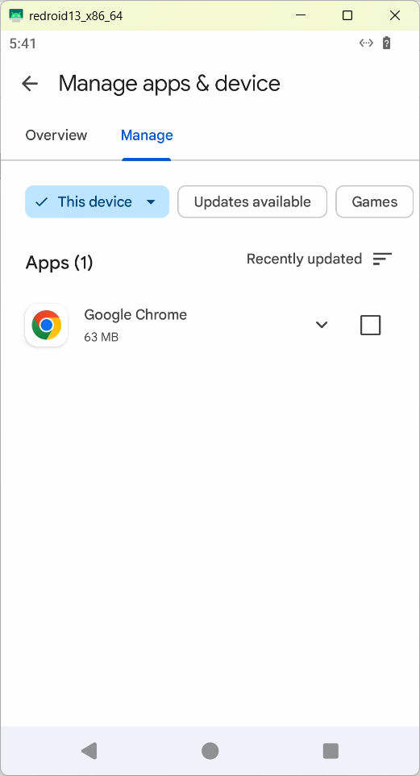
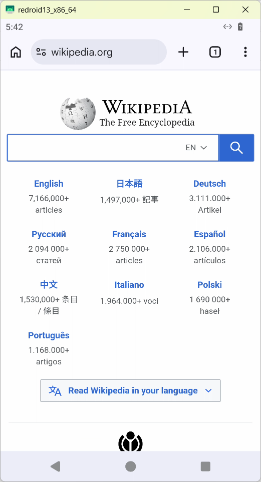
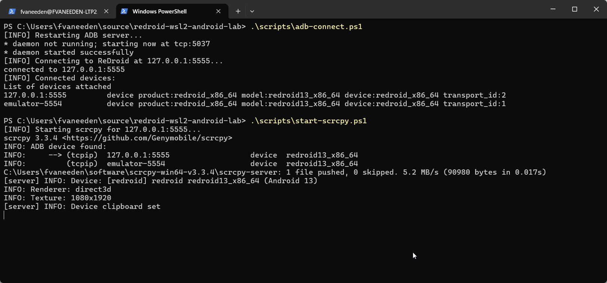

# redroid-wsl2-android-lab

## 📚 Table of Contents

- [Purpose](#-purpose)
- [Problem Statement](#-problem-statement)
- [Final Working Solution](#-final-working-solution)
- [Architecture Overview](#-architecture-overview)
- [Key Requirements](#-key-requirements)
- [What This Repo Contains](#-what-this-repo-contains)
- [Supported Modes](#-supported-modes)
- [Quick Start](#-quick-start)
- [Security Notice](#-security-notice)
- [Known Limitations](#-known-limitations)

---

## 🎯 Purpose

Provide a reproducible local development setup to run a usable **Android environment in Docker on Windows 11 + WSL2** using ReDroid.

The goal is to give developers an Android container that can be controlled interactively through ADB and scrcpy, with Google Play Services available so Chrome and other Play Store apps can be installed and tested.

This setup avoids:

- Physical Android devices
- Android Studio
- Cloud-based Android devices
- VNC-heavy Android-in-Docker images

---

## ❗ Problem Statement

Developers often need a repeatable Android environment for browser testing, app validation, automation, or integration testing, but common approaches have drawbacks.

| Approach | Issue |
|---|---|
| Android Studio Emulator | Heavyweight and often overkill for simple browser/app testing |
| docker-android / VNC-based images | Can be unstable, especially around ADB, VNC, and input |
| Google emulator containers | Can be difficult to stabilize inside WSL2 |
| Base ReDroid image | Boots Android, but does not include Google Play, Chrome, or GMS |

This repo documents a working ReDroid-based approach for Windows + WSL2.

---

## ✅ Final Working Solution

This lab provides a working setup using:

- **Windows 11 + WSL2 Ubuntu**
- **Custom WSL2 kernel** with BinderFS and Docker networking support
- **Docker**, either WSL-native with Dockhand or Docker Desktop integration
- **ReDroid Android 13 with GApps**
- **ADB over TCP**
- **scrcpy for UI control**
- **Chrome installed through Play Store**

Result:

- Android 13 container boots successfully
- Google account sign-in works
- Play Store works
- Chrome can be installed and launched
- Android UI can be controlled from Windows using scrcpy

## 📸 Screenshots

### ReDroid Home


### Play Store


### Chrome Installed


### Chrome Browser


### scrcpy UI


---

## 🧠 Architecture Overview

```text
Windows 11
  └── WSL2 Ubuntu
        ├── Custom Kernel
        │     ├── Binder / BinderFS
        │     └── Netfilter / iptables / Docker networking
        │
        ├── Docker Engine or Docker Desktop integration
        │     └── ReDroid container
        │           └── Android 13 + GApps + Play Store
        │
        ├── ADB tcp:5555
        └── scrcpy Windows UI
```

---

## ⚠️ Key Requirements

This setup depends on:

- Custom WSL2 kernel with BinderFS enabled
- Docker networking compatibility
- iptables legacy mode for the proven WSL-native Docker path
- GApps-enabled ReDroid image
- ADB installed on Windows
- scrcpy installed on Windows

Without these, the setup will fail.

Python and pip are **not required** for the final working path.

---

## 📦 What This Repo Contains

- Preconfigured **ReDroid Docker Compose stack**
- Working WSL2 kernel config
- Optional prebuilt custom kernel binary as a release/manual artifact
- Scripts for:
  - BinderFS mounting
  - iptables legacy configuration
  - ADB connection
  - scrcpy startup
  - host verification
  - ReDroid verification
- Documentation for:
  - Dockhand users
  - Docker Desktop users
  - Kernel requirements
  - Android Chrome/browser testing
  - Rollback
  - Troubleshooting known failures

---

## 🚀 Supported Modes

| Mode | Description |
|---|---|
| A | WSL2 + native Docker Engine + Dockhand |
| B | WSL2 + Docker Desktop integration |

Both modes require the same custom WSL2 kernel.

---

## ⚡ Quick Start

Choose your setup path:

- **Mode A** → WSL2 + native Docker Engine + Dockhand *(primary validated setup)*
- **Mode B** → WSL2 + Docker Desktop integration

---

### 🔧 Step 1 — Apply Custom WSL2 Kernel

Copy the prebuilt kernel to:

```text
C:\wsl-kernel\bzImage-redroid-docker-v2
```

Edit:

```text
%USERPROFILE%\.wslconfig
```

Add:

```ini
[wsl2]
kernel=C:\\wsl-kernel\\bzImage-redroid-docker-v2
```

Then restart WSL:

```powershell
wsl --shutdown
```

---

### 🔧 Step 2 — Verify Kernel + Binder

Inside WSL:

```bash
uname -a
grep binder /proc/filesystems
```

Expected:

```text
nodev binder
```

Mount binderfs:

```bash
sudo mkdir -p /dev/binderfs
sudo mount -t binder binder /dev/binderfs
ls /dev/binderfs
```

Expected:

```text
binder
hwbinder
vndbinder
```

---

### 🔧 Step 3 — Docker Setup

#### Mode A: WSL-native Docker + Dockhand

```bash
sudo update-alternatives --set iptables /usr/sbin/iptables-legacy
sudo update-alternatives --set ip6tables /usr/sbin/ip6tables-legacy

sudo systemctl restart containerd
sudo systemctl restart docker
```

#### Mode B: Docker Desktop

- Enable WSL2 backend
- Enable Ubuntu distro integration
- Ensure Docker Desktop is running

---

### 🔧 Step 4 — Start ReDroid

From WSL, inside the repo root:

```bash
docker compose -f compose/redroid-gapps.compose.yaml up -d
```

---

### 🔧 Step 5 — Connect ADB from Windows

```powershell
.\scripts\adb-connect.ps1
```

Or manually:

```powershell
adb kill-server
adb start-server
adb connect 127.0.0.1:5555
adb devices -l
```

---

### 🔧 Step 6 — Launch Android UI

```powershell
.\scripts\start-scrcpy.ps1
```

Or manually:

```powershell
scrcpy -s 127.0.0.1:5555 --no-audio
```

---

### 🔧 Step 7 — Setup Android

Inside Android:

- Sign into Google account
- Open Play Store
- Install Chrome
- Launch Chrome or another target Android app

---

## ✅ Expected Result

- Android device is usable through scrcpy
- Play Store works
- Chrome can be installed
- Google account sign-in works
- ADB connects over `127.0.0.1:5555`

---

## ⚠️ Security Notice

This repo intentionally excludes:

- Credentials
- Certificates
- API keys
- Real account data
- Sensitive screenshots
- Internal endpoints
- Production application data

Use only test accounts and non-production systems when validating the environment.

---

## ⚠️ Known Limitations

- scrcpy audio is disabled (`--no-audio`) due to missing OPUS encoder in ReDroid
- Performance is dependent on WSL2 and host machine resources
- Docker Desktop mode may behave differently than native WSL Docker
- BinderFS must be mounted after WSL restarts
- This repo provides a development/test Android environment, not a certified production Android device

---
